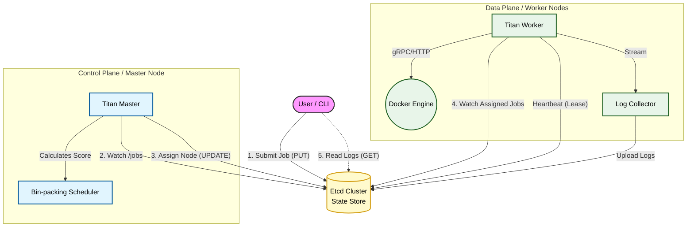

# Titan - High-Performance Distributed Container Scheduling System

   

**Titan** 是一个参考 Kubernetes 架构设计的轻量级分布式容器调度引擎。它基于 Golang、Etcd 和 Docker SDK 构建，旨在解决大规模计算任务的自动化编排、资源调度与生命周期管理问题。

> **核心特性**：全异步事件驱动调度 | Bin-packing 资源装箱 | 分布式日志收集 | 高并发容器执行

---

## 🏗 Architecture (架构设计)

Titan 采用经典的 **Master-Worker** 分布式架构，通过 Etcd 实现元数据的强一致性与组件解耦。


Master (Control Plane): 集群大脑。负责监听任务事件，通过 Bin-packing (装箱算法) 评估节点负载，将任务调度到最优节点。

Worker (Data Plane): 执行节点。负责节点自动注册、心跳保活、镜像拉取、容器启停及 Log Streaming (日志流式采集)。

Etcd: 分布式协调核心。存储任务元数据、节点状态及调度锁。

✨ Key Features (核心功能)
⚡ 高性能调度: 摒弃轮询模式，基于 Etcd Watch 机制实现事件驱动 (Event-Driven) 架构，将任务分发延迟控制在毫秒级。

🧠 智能装箱策略: 自研调度算法，基于 CPU/Memory 多维资源打分，优先填充高负载节点，显著减少资源碎片，提升集群利用率。

🐳 容器化隔离: 深度集成 Docker SDK，为每个任务创建独立的计算沙箱，支持 Shell 脚本与 Docker 镜像任务。

📊 可观测性管道: 非侵入式日志采集，Worker 实时拦截容器 Stdout/Stderr 并异步上报至分布式存储，支持任务现场还原。

💓 故障自愈: 基于 TTL 租约机制实现节点心跳检测，Master 可实时感知节点宕机并重置任务状态，保证任务不丢失。

🚀 高并发吞吐: 优化 Go Runtime 并发模型，单机压测下支持 50+ 容器并发启动，调度引擎 QPS 达到 500+。

🚀 Getting Started (快速开始)
1. Prerequisites (前置要求)
请确保你的环境已安装以下软件：
```bash
Go 1.21+
Docker Desktop (必须处于运行状态)
Git
```
2. Installation (安装项目)
```Bash
# 1. 克隆项目 (请替换为你的 GitHub 地址)
git clone [https://github.com/YOUR_USERNAME/titan.git](https://github.com/YOUR_USERNAME/titan.git)
cd titan

# 2. 下载依赖
go mod tidy
```
3. Start Dependencies (启动依赖)
本项目依赖 Etcd 作为元数据存储。推荐使用 Docker 快速启动一个单节点 Etcd：

```Bash
docker run -d --name etcd-server \
  --publish 2379:2379 \
  --env ALLOW_NONE_AUTHENTICATION=yes \
  bitnami/etcd:latest
```
💻 Usage (运行演示)
建议打开 3 个独立的终端窗口 来模拟分布式环境。

Terminal 1: 启动 Master (调度器)
Master 启动后会开始监听 Etcd 中的任务事件。

```Bash
go run cmd/master/main.go
# 输出: [Master] 🚀 Started, watching for new jobs...
```
Terminal 2: 启动 Worker (计算节点)
Worker 启动后会自动注册到 Etcd，并开始接收分配给它的任务。

```Bash
go run cmd/worker/main.go
```
# 输出: [Worker] Agent started, registered as worker-node-xx...
Terminal 3: 使用 CLI 提交任务
使用命令行工具提交任务、查询状态或查看日志。

```Bash
# 1. 提交一个普通任务
go run cmd/titan-cli/main.go
# 输出: ✅ Job submitted! ID: job-1705...

# 2. 等待几秒后，查看任务运行日志 (替换为上面生成的 ID)
go run cmd/titan-cli/main.go -getlog job-1705xxxxx
```
🧪 Stress Test (高性能压测)
Titan 支持高并发场景下的压力测试。你可以使用 CLI 的 -n 参数一次性提交大量任务，观察集群的调度与执行能力。

在 Terminal 3 中运行：

```Bash
# 模拟提交 50 个并发任务，每个任务模拟计算 5 秒
go run cmd/titan-cli/main.go -n 50 -t 5
```
预期效果：

CLI 瞬间完成 50 个任务的分发。

Master 日志疯狂滚动，毫秒级完成调度。

你的 Docker Desktop 中将看到 50 个 Alpine 容器同时运行！

📂 Project Structure (目录结构)
```Plaintext
titan/
├── cmd/
│   ├── master/         # Master 组件入口
│   ├── worker/         # Worker 组件入口
│   └── titan-cli/      # 用户命令行工具
├── internal/
│   ├── master/         # 核心调度逻辑 (Scheduler, API)
│   └── worker/         # 节点逻辑 (Agent, Executor, Docker)
├── pkg/
│   ├── model/          # 数据模型定义 (Job, Node)
│   └── store/          # Etcd 存储层封装
└── go.mod              # 依赖管理
```
